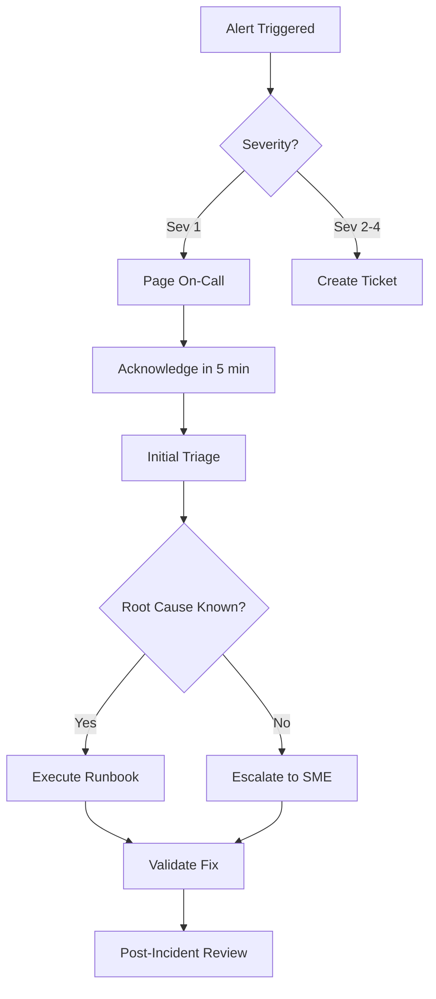

# Operations Runbook: Ecommerce Platform

**Version**: 1.0
**Date**: December 17, 2025
**Environment**: Production
**Region**: swedencentral

---

## Quick Reference

| Item                  | Value                                     |
| --------------------- | ----------------------------------------- |
| **Primary Region**    | swedencentral                             |
| **Resource Group**    | rg-ecommerce-prod-swc-001                 |
| **Support Contact**   | platform-team@contoso.com                 |
| **Escalation Path**   | On-call → Team Lead → Engineering Manager |
| **PagerDuty Service** | ecommerce-prod                            |
| **Slack Channel**     | #ecommerce-ops                            |

### Critical Resources

| Resource      | Name                               | Resource Group    |
| ------------- | ---------------------------------- | ----------------- |
| App Service   | app-ecommerce-api-prod-swc-001     | rg-ecommerce-prod |
| Function App  | func-ecommerce-orders-prod-swc-001 | rg-ecommerce-prod |
| SQL Database  | sql-ecommerce-prod-swc-{suffix}    | rg-ecommerce-prod |
| Front Door    | afd-ecommerce-prod-001             | rg-ecommerce-prod |
| Log Analytics | log-ecommerce-prod-swc-001         | rg-ecommerce-prod |

---

## 1. Daily Operations

### 1.1 Health Checks

**Morning Health Check (9:00 AM):**

1. ✅ Verify Front Door health status
2. ✅ Check App Service health probe status
3. ✅ Review overnight alerts in Azure Monitor
4. ✅ Verify order processing queue is draining
5. ✅ Check SQL DTU utilization trend

**KQL Query - System Health Overview:**

```kusto
// App Service health last 24 hours
AppServiceHTTPLogs
| where TimeGenerated > ago(24h)
| summarize
    TotalRequests = count(),
    FailedRequests = countif(ScStatus >= 500),
    AvgLatency = avg(TimeTaken)
| extend SuccessRate = round((TotalRequests - FailedRequests) * 100.0 / TotalRequests, 2)
```

### 1.2 Log Review

**Priority Logs to Review:**

| Log Source   | Query Focus          | Action Threshold |
| ------------ | -------------------- | ---------------- |
| App Service  | HTTP 5xx errors      | > 10/hour        |
| Function App | Exception count      | > 5/hour         |
| SQL Database | DTU utilization      | > 80%            |
| Service Bus  | Dead letter messages | > 0              |

**KQL Query - Error Summary:**

```kusto
// Errors last 4 hours grouped by type
union AppExceptions, FunctionAppLogs
| where TimeGenerated > ago(4h)
| where SeverityLevel >= 3
| summarize Count = count() by Type, bin(TimeGenerated, 1h)
| order by TimeGenerated desc
```

---

## 2. Routine Maintenance

### 2.1 Weekly Tasks

| Day       | Task                       | Owner  | Duration |
| --------- | -------------------------- | ------ | -------- |
| Monday    | Review cost trends         | FinOps | 15 min   |
| Tuesday   | Check security alerts      | SecOps | 30 min   |
| Wednesday | Validate backups           | Ops    | 20 min   |
| Thursday  | Review performance metrics | Dev    | 30 min   |
| Friday    | Update runbooks if needed  | Ops    | 15 min   |

**Weekly Backup Validation:**

```powershell
# Verify SQL backup status
az sql db list-restore-points `
    --resource-group rg-ecommerce-prod-swc-001 `
    --server sql-ecommerce-prod-swc-{suffix} `
    --database sqldb-ecommerce-prod `
    --output table
```

### 2.2 Monthly Tasks

| Task              | Description                         | Owner  |
| ----------------- | ----------------------------------- | ------ |
| Security Scan     | Run vulnerability assessment on SQL | SecOps |
| Cost Review       | Analyze spending vs budget          | FinOps |
| Capacity Planning | Review scaling metrics, plan ahead  | Arch   |
| DR Test           | Validate restore procedures         | Ops    |
| Access Review     | Audit RBAC assignments              | SecOps |

### 2.3 Patching Schedule

| Component              | Patch Method     | Window         | Notification        |
| ---------------------- | ---------------- | -------------- | ------------------- |
| App Service Runtime    | Platform-managed | Automatic      | Azure notifications |
| Function Runtime       | Platform-managed | Automatic      | Azure notifications |
| Application Code       | Deployment slots | Tue/Thu 2-4 AM | 24h advance         |
| Infrastructure (Bicep) | CI/CD pipeline   | Wed 2-4 AM     | 24h advance         |

---

## 3. Incident Response

### 3.1 Severity Definitions

| Severity  | Definition                       | Response Time     | Examples                    |
| --------- | -------------------------------- | ----------------- | --------------------------- |
| **Sev 1** | Complete outage, revenue impact  | 15 minutes        | Site down, payment failures |
| **Sev 2** | Degraded service, partial impact | 1 hour            | Slow response, search down  |
| **Sev 3** | Minor issue, workaround exists   | 4 hours           | Single feature broken       |
| **Sev 4** | Cosmetic, no business impact     | Next business day | UI glitch, typo             |

### 3.2 Incident Response Process



### 3.3 Common Issues & Resolutions

#### Issue: High Response Latency (> 500ms)

**Symptoms:** Slow page loads, timeout errors

**Diagnosis:**

```kusto
AppServiceHTTPLogs
| where TimeGenerated > ago(1h)
| where TimeTaken > 500
| summarize Count = count(), AvgLatency = avg(TimeTaken) by CsUriStem
| order by Count desc
| take 10
```

**Resolution:**

1. Check SQL DTU utilization → Scale up if > 80%
2. Check Redis memory → Clear cache if needed
3. Check App Service CPU → Scale out if > 70%
4. Review slow queries in Query Performance Insight

---

#### Issue: Order Processing Backlog

**Symptoms:** Orders not processing, queue growing

**Diagnosis:**

```kusto
AzureDiagnostics
| where ResourceProvider == "MICROSOFT.SERVICEBUS"
| where TimeGenerated > ago(1h)
| summarize MessageCount = sum(ActiveMessageCount) by bin(TimeGenerated, 5m)
```

**Resolution:**

1. Check Function App health in portal
2. Verify Service Bus connectivity
3. Check for exceptions in Function logs
4. Scale Function App manually if needed:

```powershell
az functionapp scale `
    --resource-group rg-ecommerce-prod-swc-001 `
    --name func-ecommerce-orders-prod-swc-001 `
    --max-instances 10
```

---

#### Issue: SQL Database Connection Failures

**Symptoms:** 500 errors, "connection refused"

**Diagnosis:**

```kusto
AzureDiagnostics
| where ResourceProvider == "MICROSOFT.SQL"
| where Category == "Errors"
| where TimeGenerated > ago(1h)
| project TimeGenerated, Message, error_number_d
```

**Resolution:**

1. Verify SQL Server is online
2. Check private endpoint DNS resolution
3. Verify NSG allows traffic from web subnet
4. Check connection string in Key Vault

---

#### Issue: Front Door 503 Errors

**Symptoms:** Users see 503, health probes failing

**Diagnosis:**

```kusto
AzureDiagnostics
| where ResourceProvider == "MICROSOFT.CDN"
| where Category == "FrontDoorHealthProbeLog"
| where TimeGenerated > ago(1h)
| where healthProbeResult_s != "Healthy"
```

**Resolution:**

1. Check App Service health endpoint (/health)
2. Verify App Service is running
3. Check if deployment in progress
4. Verify Front Door origin configuration

---

## 4. Scaling Procedures

### 4.1 Scale Up (Vertical)

**When:** Consistent high resource utilization

| Resource     | Current SKU  | Scale-Up SKU | Monthly Cost Delta |
| ------------ | ------------ | ------------ | ------------------ |
| App Service  | P1v4         | P2v4         | +$206              |
| SQL Database | S3 (100 DTU) | S4 (200 DTU) | +$145              |
| Redis Cache  | C2 (2.5 GB)  | C3 (6 GB)    | +$60               |

**Procedure:**

```powershell
# Scale App Service Plan
az appservice plan update `
    --resource-group rg-ecommerce-prod-swc-001 `
    --name asp-ecommerce-prod-swc-001 `
    --sku P2V4
```

### 4.2 Scale Out (Horizontal)

**When:** Traffic spikes, sales events

**Manual Scale-Out:**

```powershell
# Add instances to App Service
az webapp update `
    --resource-group rg-ecommerce-prod-swc-001 `
    --name app-ecommerce-api-prod-swc-001 `
    --set siteConfig.numberOfWorkers=4
```

**Auto-Scale Configuration:**

```powershell
# Configure auto-scale rule
az monitor autoscale create `
    --resource-group rg-ecommerce-prod-swc-001 `
    --resource asp-ecommerce-prod-swc-001 `
    --resource-type Microsoft.Web/serverfarms `
    --min-count 2 `
    --max-count 10 `
    --count 2
```

### 4.3 Scale Down

**When:** Post-event, reduced traffic

**Procedure:**

1. Verify traffic has normalized (30+ minutes)
2. Check no pending orders in queue
3. Scale down gradually (1 instance at a time)
4. Monitor for 15 minutes after each reduction

---

## 5. Deployment Procedures

### 5.1 Standard Deployment

**Pre-Deployment Checklist:**

- [ ] All tests passing in staging
- [ ] Change approved in change management
- [ ] Rollback plan documented
- [ ] On-call engineer notified
- [ ] Deployment window confirmed

**Deployment Steps:**

1. Deploy to staging slot:

```powershell
az webapp deployment slot swap `
    --resource-group rg-ecommerce-prod-swc-001 `
    --name app-ecommerce-api-prod-swc-001 `
    --slot staging `
    --target-slot production `
    --action preview
```

2. Warm up staging slot (5 minutes)
3. Execute swap:

```powershell
az webapp deployment slot swap `
    --resource-group rg-ecommerce-prod-swc-001 `
    --name app-ecommerce-api-prod-swc-001 `
    --slot staging `
    --target-slot production
```

4. Monitor for 15 minutes
5. Mark deployment successful or initiate rollback

### 5.2 Emergency Deployment (Hotfix)

**Expedited Process:**

1. Create hotfix branch from production tag
2. Apply minimal fix, peer review required
3. Deploy directly to staging, smoke test
4. Swap with production (skip warm-up if critical)
5. Post-incident review within 24 hours

### 5.3 Rollback Procedures

**Immediate Rollback (< 5 minutes):**

```powershell
# Swap back to previous version (still in staging slot)
az webapp deployment slot swap `
    --resource-group rg-ecommerce-prod-swc-001 `
    --name app-ecommerce-api-prod-swc-001 `
    --slot staging `
    --target-slot production
```

**Database Rollback:**

⚠️ **Warning:** Database rollbacks require careful consideration

1. Stop application traffic (route to maintenance page)
2. Point-in-time restore to new database
3. Update connection string
4. Validate data integrity
5. Resume traffic

---

## 6. Contact Information

| Role                    | Contact                   | Availability   | Escalation           |
| ----------------------- | ------------------------- | -------------- | -------------------- |
| **Primary On-Call**     | ops-oncall@contoso.com    | 24/7           | 15 min response      |
| **Secondary On-Call**   | ops-backup@contoso.com    | 24/7           | 30 min response      |
| **Team Lead**           | platform-lead@contoso.com | Business hours | Sev 1 only           |
| **Engineering Manager** | eng-manager@contoso.com   | Business hours | Executive escalation |
| **Azure Support**       | support.microsoft.com     | 24/7           | Sev A/B cases        |

### Escalation Matrix

| Time Since Incident | Action                               |
| ------------------- | ------------------------------------ |
| 0 min               | Primary on-call paged                |
| 15 min              | Secondary on-call paged              |
| 30 min              | Team Lead notified                   |
| 1 hour              | Engineering Manager notified (Sev 1) |
| 2 hours             | Azure Support engaged (if needed)    |

---

## Appendix: Useful Commands

### Quick Health Check

```powershell
# Check all resources in resource group
az resource list --resource-group rg-ecommerce-prod-swc-001 --output table

# Check App Service status
az webapp show --resource-group rg-ecommerce-prod-swc-001 --name app-ecommerce-api-prod-swc-001 --query state

# Check Function App status
az functionapp show --resource-group rg-ecommerce-prod-swc-001 --name func-ecommerce-orders-prod-swc-001 --query state
```

### View Recent Logs

```powershell
# Stream App Service logs
az webapp log tail --resource-group rg-ecommerce-prod-swc-001 --name app-ecommerce-api-prod-swc-001

# Stream Function App logs
az functionapp log tail --resource-group rg-ecommerce-prod-swc-001 --name func-ecommerce-orders-prod-swc-001
```

### Restart Services

```powershell
# Restart App Service
az webapp restart --resource-group rg-ecommerce-prod-swc-001 --name app-ecommerce-api-prod-swc-001

# Restart Function App
az functionapp restart --resource-group rg-ecommerce-prod-swc-001 --name func-ecommerce-orders-prod-swc-001
```
