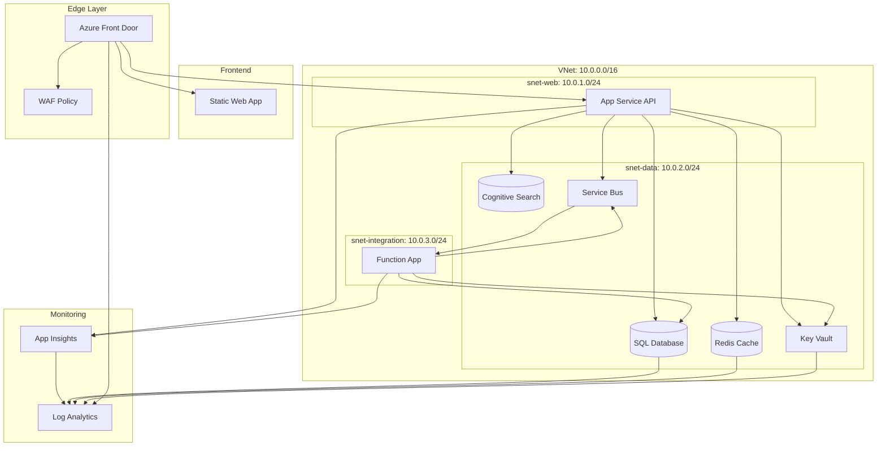

# Resource Inventory: Ecommerce Platform

**Generated**: December 17, 2025
**Source**: Infrastructure as Code (Bicep)
**Environment**: Production
**Region**: swedencentral

---

## Summary

| Category            | Count |
| ------------------- | ----- |
| **Total Resources** | 26    |
| 💻 Compute          | 5     |
| 💾 Data Services    | 4     |
| 🌐 Networking       | 8     |
| 📨 Messaging        | 1     |
| 🔐 Security         | 2     |
| 📊 Monitoring       | 3     |
| 🌍 Edge             | 3     |

---

## Resource Listing

### 💻 Compute Resources

| Name                               | Type             | SKU      | Location      | Purpose                      |
| ---------------------------------- | ---------------- | -------- | ------------- | ---------------------------- |
| asp-ecommerce-prod-swc-001         | App Service Plan | P1v4     | swedencentral | API hosting (zone redundant) |
| app-ecommerce-api-prod-swc-001     | App Service      | P1v4     | swedencentral | .NET 8 REST API              |
| asp-func-ecommerce-prod-swc-001    | App Service Plan | EP1      | swedencentral | Functions hosting (elastic)  |
| func-ecommerce-orders-prod-swc-001 | Function App     | EP1      | swedencentral | Order processing             |
| swa-ecommerce-prod-swc-001         | Static Web App   | Standard | westeurope    | React SPA frontend           |

### 💾 Data Services

| Name                            | Type             | SKU          | Configuration           | Location      |
| ------------------------------- | ---------------- | ------------ | ----------------------- | ------------- |
| sql-ecommerce-prod-swc-{suffix} | SQL Server       | -            | Azure AD-only auth      | swedencentral |
| sqldb-ecommerce-prod            | SQL Database     | S3 (100 DTU) | Zone redundant backup   | swedencentral |
| redis-ecommerce-prod-{suffix}   | Redis Cache      | C2 Basic     | 2.5 GB, TLS 1.2         | swedencentral |
| srch-ecommerce-prod-{suffix}    | Cognitive Search | S1 Standard  | 35 GB index, 3 replicas | swedencentral |

### 🌐 Networking Resources

| Name                         | Type                   | Configuration                            | Location      |
| ---------------------------- | ---------------------- | ---------------------------------------- | ------------- |
| vnet-ecommerce-prod-swc-001  | Virtual Network        | 10.0.0.0/16                              | swedencentral |
| snet-web-prod                | Subnet                 | 10.0.1.0/24                              | swedencentral |
| snet-data-prod               | Subnet                 | 10.0.2.0/24                              | swedencentral |
| snet-integration-prod        | Subnet                 | 10.0.3.0/24                              | swedencentral |
| nsg-web-prod-swc-001         | Network Security Group | Web tier rules                           | swedencentral |
| nsg-data-prod-swc-001        | Network Security Group | Data tier rules                          | swedencentral |
| nsg-integration-prod-swc-001 | Network Security Group | Integration tier rules                   | swedencentral |
| pe-\* (5 endpoints)          | Private Endpoints      | SQL, Redis, Search, ServiceBus, KeyVault | swedencentral |

### 📨 Messaging Resources

| Name                       | Type        | SKU     | Configuration          | Location      |
| -------------------------- | ----------- | ------- | ---------------------- | ------------- |
| sb-ecommerce-prod-{suffix} | Service Bus | Premium | 1 MU, private endpoint | swedencentral |

### 🔐 Security Resources

| Name                      | Type       | SKU      | Purpose               | Location      |
| ------------------------- | ---------- | -------- | --------------------- | ------------- |
| kv-ecom-prod-{suffix}     | Key Vault  | Standard | Secrets, certificates | swedencentral |
| wafpolicyecommerceprod001 | WAF Policy | Premium  | OWASP 3.2 rules       | Global        |

### 📊 Monitoring Resources

| Name                        | Type                 | Configuration                 | Location      |
| --------------------------- | -------------------- | ----------------------------- | ------------- |
| log-ecommerce-prod-swc-001  | Log Analytics        | 90-day retention              | swedencentral |
| appi-ecommerce-prod-swc-001 | Application Insights | Connected to Log Analytics    | swedencentral |
| diag-\*                     | Diagnostic Settings  | All resources → Log Analytics | swedencentral |

### 🌍 Edge Resources

| Name                   | Type                    | SKU     | Configuration             | Location |
| ---------------------- | ----------------------- | ------- | ------------------------- | -------- |
| afd-ecommerce-prod-001 | Front Door              | Premium | WAF enabled               | Global   |
| afd-endpoint-\*        | Front Door Endpoint     | -       | Custom domain ready       | Global   |
| afd-origin-group-\*    | Front Door Origin Group | -       | App Service + SWA origins | Global   |

---

## Private DNS Zones

| Zone                                | Linked VNet                 | Purpose          |
| ----------------------------------- | --------------------------- | ---------------- |
| privatelink.database.windows.net    | vnet-ecommerce-prod-swc-001 | SQL Server       |
| privatelink.redis.cache.windows.net | vnet-ecommerce-prod-swc-001 | Redis Cache      |
| privatelink.search.windows.net      | vnet-ecommerce-prod-swc-001 | Cognitive Search |
| privatelink.servicebus.windows.net  | vnet-ecommerce-prod-swc-001 | Service Bus      |
| privatelink.vaultcore.azure.net     | vnet-ecommerce-prod-swc-001 | Key Vault        |

---

## IP Address Allocation

| Resource                                 | Subnet                | Private IP | Public IP | Notes            |
| ---------------------------------------- | --------------------- | ---------- | --------- | ---------------- |
| app-ecommerce-api (VNet integration)     | snet-web-prod         | Dynamic    | None      | Outbound only    |
| func-ecommerce-orders (VNet integration) | snet-integration-prod | Dynamic    | None      | Outbound only    |
| pe-sql                                   | snet-data-prod        | 10.0.2.4   | None      | Private endpoint |
| pe-redis                                 | snet-data-prod        | 10.0.2.5   | None      | Private endpoint |
| pe-search                                | snet-data-prod        | 10.0.2.6   | None      | Private endpoint |
| pe-servicebus                            | snet-data-prod        | 10.0.2.7   | None      | Private endpoint |
| pe-keyvault                              | snet-data-prod        | 10.0.2.8   | None      | Private endpoint |

---

## Resource Dependencies



---

## Tags Applied

| Resource      | Environment | Project            | Owner         | CostCenter  | Compliance |
| ------------- | ----------- | ------------------ | ------------- | ----------- | ---------- |
| All resources | prod        | ecommerce-platform | platform-team | CC-ECOM-001 | PCI-DSS    |

**Tag Enforcement:** All resources include mandatory tags via Bicep `tags` variable inheritance.

---

## Module Summary

The Bicep implementation consists of 19 modules:

| Module                 | Resources Created        | Dependencies                                  |
| ---------------------- | ------------------------ | --------------------------------------------- |
| nsg.bicep              | 3 NSGs                   | None                                          |
| network.bicep          | 1 VNet, 3 subnets        | NSG module                                    |
| private-dns.bicep      | 5 DNS zones              | Network module                                |
| key-vault.bicep        | 1 Key Vault, 1 PE        | Network, DNS modules                          |
| app-service-plan.bicep | 1 ASP (P1v4)             | None                                          |
| sql.bicep              | 1 SQL Server, 1 DB, 1 PE | Network, DNS modules                          |
| redis.bicep            | 1 Redis, 1 PE            | Network, DNS modules                          |
| cognitive-search.bicep | 1 Search, 1 PE           | Network, DNS modules                          |
| service-bus.bicep      | 1 SB namespace, 1 PE     | Network, DNS modules                          |
| app-service.bicep      | 1 App Service            | ASP, Network, KeyVault, AppInsights           |
| functions-plan.bicep   | 1 ASP (EP1)              | None                                          |
| functions.bicep        | 1 Function App           | Functions Plan, Network, KeyVault, ServiceBus |
| rbac.bicep             | Role assignments         | All service modules                           |
| log-analytics.bicep    | 1 Log Analytics          | None                                          |
| app-insights.bicep     | 1 App Insights           | Log Analytics                                 |
| waf-policy.bicep       | 1 WAF policy             | None                                          |
| front-door.bicep       | 1 Front Door             | WAF, App Service, SWA                         |
| static-web-app.bicep   | 1 SWA                    | None                                          |
| diagnostics.bicep      | Diagnostic settings      | All resources, Log Analytics                  |

---

## Cost by Resource

| Resource                 | Type                | Monthly Cost | % of Total |
| ------------------------ | ------------------- | ------------ | ---------- |
| asp-ecommerce-prod (x2)  | App Service Plan    | $412         | 26%        |
| afd-ecommerce-prod       | Front Door Premium  | $330         | 21%        |
| srch-ecommerce-prod      | Cognitive Search S1 | $245         | 15%        |
| sb-ecommerce-prod        | Service Bus Premium | $200         | 13%        |
| sql-ecommerce-prod       | SQL Database S3     | $145         | 9%         |
| func-ecommerce-orders    | Functions EP1       | $123         | 8%         |
| redis-ecommerce-prod     | Redis C2            | $66          | 4%         |
| Private Endpoints (5)    | Networking          | $37          | 2%         |
| Other (KV, Log, Storage) | Various             | $37          | 2%         |
| **Total**                |                     | **~$1,595**  | 100%       |

---

## Validation Commands

```bash
# List all resources in resource group
az resource list \
    --resource-group rg-ecommerce-prod-swc-001 \
    --output table

# Verify Bicep template
cd infra/bicep/ecommerce
bicep build main.bicep
bicep lint main.bicep

# What-If deployment
az deployment group what-if \
    --resource-group rg-ecommerce-prod-swc-001 \
    --template-file main.bicep \
    --parameters main.bicepparam
```
