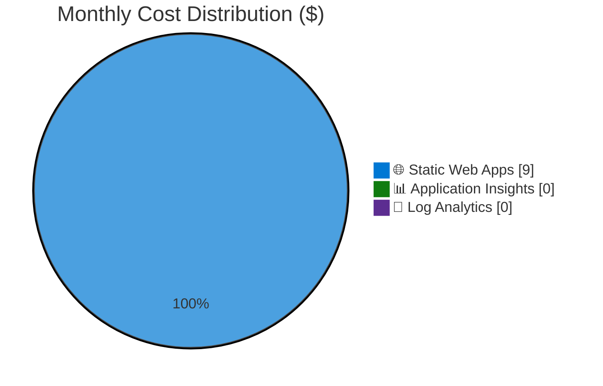

# Azure Cost Estimate: infraops-static-demo

**Generated**: 2026-01-20
**Region**: westeurope
**Environment**: Production
**MCP Tools Used**: azure_cost_estimate, microsoft_docs_search
**Architecture Reference**: [02-architecture-assessment.md](02-architecture-assessment.md)

## 💰 Cost At-a-Glance

> **Monthly Total: ~$9** | Annual: ~$108
>
> ```
> Budget: $15/month (soft) | Utilization: 60% ($9 of $15)
> ```
>
> | Status            | Indicator                              |
> | ----------------- | -------------------------------------- |
> | Cost Trend        | ➡️ Stable (flat-rate pricing)          |
> | Savings Available | 💰 $0/year (already optimized)         |
> | Compliance        | ✅ No specific compliance requirements |

## ✅ Decision Summary

- ✅ Approved: Static Web Apps Standard + Application Insights (free tier)
- ⏳ Deferred: Custom domain SSL (using managed certificates), Azure Front Door WAF
- 🔁 Redesign Trigger: If >100GB bandwidth/month or WAF requirement added

**Confidence**: High | **Expected Variance**: ±5% (flat-rate pricing, minimal variables)

## 🔁 Requirements → Cost Mapping

| Requirement             | Architecture Decision        | Cost Impact | Mandatory |
| ----------------------- | ---------------------------- | ----------- | --------- |
| 99.9% SLA               | Standard tier (not Free)     | +$9/month   | Yes       |
| <200ms TTFB             | Included CDN (no extra cost) | $0          | Yes       |
| Application Insights    | Workspace-based, free tier   | $0          | Yes       |
| HTTPS + managed SSL     | Included in Standard         | $0          | Yes       |
| 10 staging environments | Included in Standard         | $0          | Yes       |

## 📊 Top 5 Cost Drivers

| Rank | Resource             | Monthly Cost | % of Total | Trend |
| ---- | -------------------- | ------------ | ---------- | ----- |
| 1️⃣   | Static Web Apps      | $9.00        | 100%       | ➡️    |
| 2️⃣   | Application Insights | $0.00        | 0%         | ➡️    |
| 3️⃣   | Log Analytics        | $0.00        | 0%         | ➡️    |
| 4️⃣   | Bandwidth (included) | $0.00        | 0%         | ➡️    |
| 5️⃣   | SSL Certificates     | $0.00        | 0%         | ➡️    |

> 💡 **Quick Win**: Use Free tier for dev/test environments (saves $9/month per environment)

## Architecture Overview

### Cost Distribution



### Key Design Decisions Affecting Cost

| Decision                     | Cost Impact | Business Rationale                 | Status   |
| ---------------------------- | ----------- | ---------------------------------- | -------- |
| Standard tier over Free      | +$9/month   | 99.9% SLA required for production  | Required |
| Workspace-based App Insights | $0          | 5 GB free tier sufficient for demo | Required |
| Managed SSL certificates     | $0          | Auto-renewal, zero maintenance     | Required |

## 🧾 What We Are Not Paying For (Yet)

- ❌ Azure Front Door (WAF, advanced DDoS)
- ❌ Custom domains with external SSL
- ❌ Managed Functions (API backend)
- ❌ Private endpoints
- ❌ Bandwidth overage (100 GB included)

### Assumptions & Uncertainty

- Traffic expected to stay well under 100 GB/month
- Application Insights ingestion <5 GB/month (free tier)
- No managed API functions needed (client-side only SPA)
- Single production environment with staging slots

## ⚠️ Cost Risk Indicators

| Resource               | Risk Level | Issue                        | Mitigation                       |
| ---------------------- | ---------- | ---------------------------- | -------------------------------- |
| Bandwidth overage      | 🟢 Low     | >100 GB triggers $0.20/GB    | Monitor usage, unlikely for demo |
| App Insights ingestion | 🟢 Low     | >5 GB triggers pay-as-you-go | Set daily cap, use sampling      |

> **⚠️ Watch Item**: Monitor Application Insights ingestion if adding verbose telemetry

## 🎯 Quick Decision Matrix

_"If you need X, expect to pay Y more"_

| Requirement              | Additional Cost | SKU Change                   | Notes                            |
| ------------------------ | --------------- | ---------------------------- | -------------------------------- |
| Web Application Firewall | +$335/month     | Add Azure Front Door Premium | Enterprise security              |
| Custom authentication    | +$0             | Already in Standard          | Use custom provider registration |
| Private endpoints        | +$0             | Already in Standard          | Network isolation available      |
| API backend (Functions)  | +$0-50/month    | Managed or BYOF              | Depends on execution volume      |
| >100 GB bandwidth        | +$0.20/GB       | Overage pricing              | Unlikely for typical SPA         |

## 💰 Savings Opportunities

> ### Total Potential Savings: $108/year (dev/test only)
>
> | Commitment         | Monthly Savings | Annual Savings |
> | ------------------ | --------------- | -------------- |
> | Free tier (dev)    | $9              | $108           |
> | No further savings | -               | -              |

**Note**: Standard tier is already the most cost-effective production option. No reserved capacity available for Static Web Apps.

## Detailed Cost Breakdown

### Assumptions

- Hours: N/A (flat-rate serverless pricing)
- Bandwidth: <100 GB/month (included)
- App Insights ingestion: <5 GB/month (free tier)
- Storage: <500 MB per environment (included)

### Line Items

| Category      | Service              | SKU / Meter    | Quantity / Units | Est. Monthly |
| ------------- | -------------------- | -------------- | ---------------- | ------------ |
| 🌐 Hosting    | Static Web Apps      | Standard       | 1 app            | $9.00        |
| 📊 Monitoring | Application Insights | Pay-as-you-go  | <5 GB            | $0.00        |
| 💾 Logs       | Log Analytics        | Pay-as-you-go  | Included         | $0.00        |
| 🔐 Security   | SSL Certificate      | Managed (free) | 1 cert           | $0.00        |
| 🌍 CDN        | Included CDN         | -              | 100 GB           | $0.00        |
| **TOTAL**     |                      |                |                  | **$9.00**    |

### Notes

- Static Web Apps Standard is flat-rate at ~$9/month (check [Azure Pricing](https://azure.microsoft.com/pricing/details/app-service/static/) for current rates)
- Application Insights provides 5 GB/month free data ingestion per Log Analytics workspace
- No reservation discounts available for serverless Static Web Apps
- Free tier is suitable for dev/test but lacks SLA guarantee

---

## References

- [Azure Static Web Apps Pricing](https://azure.microsoft.com/pricing/details/app-service/static/)
- [Application Insights Pricing](https://azure.microsoft.com/pricing/details/monitor/)
- [Static Web Apps Quotas](https://learn.microsoft.com/azure/static-web-apps/quotas)
