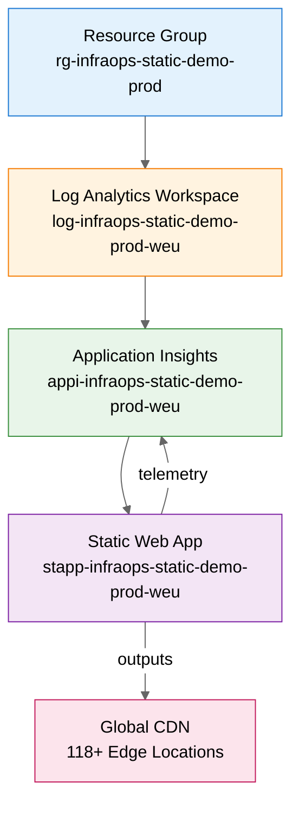

# Step 4: Implementation Plan - infraops-static-demo

> Generated by bicep-plan agent | 2026-01-20

## Overview

This implementation plan details the Bicep infrastructure code required to deploy an **Azure Static Web App** with **Application Insights** monitoring for the `infraops-static-demo` project. The architecture follows the design validated in the architecture assessment, using Azure Verified Modules (AVM) for consistent, secure deployments.

**Key Decisions:**

- **AVM Modules**: Using latest Azure Verified Modules for Static Web App and Application Insights
- **Region**: westeurope (as specified in requirements)
- **Tier**: Static Web App Standard for 99.9% SLA
- **Observability**: Workspace-based Application Insights (recommended model)

---

### Governance Alignment

This plan complies with governance constraints discovered in [04-governance-constraints.md](04-governance-constraints.md).

**Key constraints applied:**

- ✅ No blocking Azure Policy assignments detected
- ✅ HTTPS enforced by platform default
- ✅ westeurope region available and approved
- ✅ CAF naming conventions applied

---

## Resource Inventory

| Resource                | Type                                     | AVM Module                                      | SKU       | Dependencies   |
| ----------------------- | ---------------------------------------- | ----------------------------------------------- | --------- | -------------- |
| Resource Group          | Microsoft.Resources/resourceGroups       | N/A (CLI)                                       | -         | None           |
| Log Analytics Workspace | Microsoft.OperationalInsights/workspaces | `avm/res/operational-insights/workspace:0.15.0` | PerGB2018 | Resource Group |
| Application Insights    | Microsoft.Insights/components            | `avm/res/insights/component:0.7.1`              | -         | Log Analytics  |
| Static Web App          | Microsoft.Web/staticSites                | `avm/res/web/static-site:0.9.3`                 | Standard  | App Insights   |

---

## Module Structure

```
infra/bicep/infraops-static-demo/
├── main.bicep                    # Orchestration entry point
├── main.bicepparam               # Parameter file for deployment
├── modules/
│   ├── log-analytics.bicep       # Log Analytics Workspace module
│   ├── app-insights.bicep        # Application Insights module
│   └── static-web-app.bicep      # Static Web App module
└── deploy.ps1                    # PowerShell deployment script
```

---

### Resources

### Log Analytics Workspace

```yaml
name: log-analytics-workspace
kind: AVM
avmModule: br/public:avm/res/operational-insights/workspace:0.15.0

purpose: Central log storage for Application Insights telemetry
dependsOn: []

parameters:
  required:
    - name: name
      type: string
      description: Name of the Log Analytics workspace
      example: "log-infraops-static-demo-prod-weu"
    - name: location
      type: string
      description: Azure region for deployment
      example: "westeurope"
  optional:
    - name: retentionInDays
      type: int
      description: Data retention period
      default: 30
    - name: skuName
      type: string
      description: Pricing tier
      default: "PerGB2018"
    - name: tags
      type: object
      description: Resource tags
      default: {}

outputs:
  - name: resourceId
    type: string
    description: Resource ID of the Log Analytics workspace
  - name: name
    type: string
    description: Name of the deployed workspace

estimatedCost:
  sku: PerGB2018
  monthlyRange: "$0 (5 GB free tier)"
  costDrivers: [data ingestion beyond 5GB, retention beyond 30 days]

references:
  docs: https://learn.microsoft.com/azure/azure-monitor/logs/log-analytics-workspace-overview
  avm: https://github.com/Azure/bicep-registry-modules/tree/avm/res/operational-insights/workspace/0.15.0
```

---

### Application Insights

```yaml
name: application-insights
kind: AVM
avmModule: br/public:avm/res/insights/component:0.7.1

purpose: Telemetry and monitoring for Static Web App
dependsOn: [log-analytics-workspace]

parameters:
  required:
    - name: name
      type: string
      description: Name of the Application Insights instance
      example: "appi-infraops-static-demo-prod-weu"
    - name: location
      type: string
      description: Azure region for deployment
      example: "westeurope"
    - name: workspaceResourceId
      type: string
      description: Resource ID of Log Analytics workspace
      example: "/subscriptions/.../workspaces/log-..."
  optional:
    - name: applicationType
      type: string
      description: Application type
      default: "web"
    - name: kind
      type: string
      description: Kind of Application Insights
      default: "web"
    - name: tags
      type: object
      description: Resource tags
      default: {}

outputs:
  - name: resourceId
    type: string
    description: Resource ID of Application Insights
  - name: connectionString
    type: string
    description: Connection string for SDK configuration
  - name: instrumentationKey
    type: string
    description: Instrumentation key (legacy)

estimatedCost:
  sku: Pay-as-you-go
  monthlyRange: "$0 (5 GB free tier)"
  costDrivers: [data ingestion beyond 5GB, sampling configuration]

references:
  docs: https://learn.microsoft.com/azure/azure-monitor/app/app-insights-overview
  avm: https://github.com/Azure/bicep-registry-modules/tree/avm/res/insights/component/0.7.1
```

---

### Static Web App

```yaml
name: static-web-app
kind: AVM
avmModule: br/public:avm/res/web/static-site:0.9.3

purpose: Host React SPA with global CDN and staging environments
dependsOn: [application-insights]

parameters:
  required:
    - name: name
      type: string
      description: Name of the Static Web App
      example: "stapp-infraops-static-demo-prod-weu"
    - name: location
      type: string
      description: Azure region for deployment
      example: "westeurope"
  optional:
    - name: sku
      type: string
      description: Hosting plan tier
      default: "Standard"
    - name: stagingEnvironmentPolicy
      type: string
      description: Policy for staging environments
      default: "Enabled"
    - name: allowConfigFileUpdates
      type: bool
      description: Allow config file updates
      default: true
    - name: enterpriseGradeCdnStatus
      type: string
      description: Enterprise CDN status
      default: "Disabled"
    - name: tags
      type: object
      description: Resource tags
      default: {}

outputs:
  - name: resourceId
    type: string
    description: Resource ID of Static Web App
  - name: defaultHostname
    type: string
    description: Default hostname (*.azurestaticapps.net)
  - name: name
    type: string
    description: Name of the deployed Static Web App

estimatedCost:
  sku: Standard
  monthlyRange: "$9/month"
  costDrivers: [bandwidth overage beyond 100GB at $0.20/GB]

references:
  docs: https://learn.microsoft.com/azure/static-web-apps/overview
  avm: https://github.com/Azure/bicep-registry-modules/tree/avm/res/web/static-site/0.9.3
```

---

### Cost Estimation

**Use Azure Pricing MCP tools for real-time pricing data:**

- `azure_price_search` - Query current prices for specific SKUs
- `azure_cost_estimate` - Calculate monthly costs based on usage hours
- `azure_region_recommend` - Find cheapest regions for each SKU

### Monthly Cost Breakdown

| Resource                | SKU/Tier      | Quantity | Unit Cost     | Monthly Cost |
| ----------------------- | ------------- | -------- | ------------- | ------------ |
| Log Analytics Workspace | PerGB2018     | 1        | $0 (5GB free) | $0.00        |
| Application Insights    | Pay-as-you-go | 1        | $0 (5GB free) | $0.00        |
| Static Web App          | Standard      | 1        | $9.00         | $9.00        |
| **Total**               |               |          |               | **$9.00**    |

> 💰 **Note**: Prices shown are Azure retail list prices (pay-as-you-go) for westeurope region

**Cost Optimization Opportunities:**

- Use Free tier for dev/test environments: Saves $9/month per environment
- Monitor Application Insights ingestion to stay within free tier

**Cost Assumptions:**

- Region: westeurope
- Usage patterns: Typical SPA traffic under 100GB/month
- Data transfer: Minimal egress (CDN cached)
- Reservation discounts: Not applicable for serverless

---

## Implementation Tasks

### Phase 1 — Foundation & Monitoring

**Objective:** Deploy monitoring infrastructure (Log Analytics + Application Insights)

**IMPLEMENT-GOAL-001:** Create monitoring foundation for telemetry collection

| Task     | Description                             | Action                                                    |
| -------- | --------------------------------------- | --------------------------------------------------------- |
| TASK-001 | Create `main.bicep` orchestration file  | Create `infra/bicep/infraops-static-demo/main.bicep`      |
| TASK-002 | Create `main.bicepparam` parameter file | Create `infra/bicep/infraops-static-demo/main.bicepparam` |
| TASK-003 | Create Log Analytics module             | Create `modules/log-analytics.bicep` with AVM module      |
| TASK-004 | Create Application Insights module      | Create `modules/app-insights.bicep` with AVM module       |

---

### Phase 2 — Static Web App

**Objective:** Deploy Static Web App with Standard tier configuration

**IMPLEMENT-GOAL-002:** Create Static Web App connected to Application Insights

| Task     | Description                             | Action                                                |
| -------- | --------------------------------------- | ----------------------------------------------------- |
| TASK-005 | Create Static Web App module            | Create `modules/static-web-app.bicep` with AVM module |
| TASK-006 | Configure app settings for App Insights | Add connection string to SWA config                   |
| TASK-007 | Wire up module outputs in main.bicep    | Connect module dependencies                           |

---

### Phase 3 — Deployment Automation

**Objective:** Create deployment script with validation and what-if support

**IMPLEMENT-GOAL-003:** Create PowerShell deployment script following best practices

| Task     | Description                     | Action                                      |
| -------- | ------------------------------- | ------------------------------------------- |
| TASK-008 | Create `deploy.ps1` script      | Create deployment script with ShouldProcess |
| TASK-009 | Add Bicep lint/build validation | Pre-deployment validation                   |
| TASK-010 | Add what-if preview support     | Safe deployment preview                     |
| TASK-011 | Add output display              | Show deployment results                     |

---

## Dependency Graph



### Architecture Overview

---

        subgraph "Monitoring"
            LAW[Log Analytics]
            APPI[App Insights]
        end

        subgraph "Hosting"
            SWA[Static Web App<br/>Standard Tier]
            PROD[Production]
            STAGE[Staging Slots]
        end
    end

    subgraph "Global CDN"
        EDGE[118+ Edge<br/>Locations]
    end

    REPO --> GHA
    GHA --> SWA
    SWA --> PROD
    SWA --> STAGE
    PROD --> EDGE
    PROD --> APPI
    LAW --> APPI

    USERS[Global Users] --> EDGE

````

**Deployment Order:**

1. Resource Group (foundation)
2. Log Analytics Workspace (monitoring foundation)
3. Application Insights (depends on Log Analytics)
4. Static Web App (depends on App Insights for telemetry)

---

## Implementation Tasks

### Phase 1 — Foundation & Monitoring

**Objective:** Deploy monitoring infrastructure (Log Analytics + Application Insights)

**IMPLEMENT-GOAL-001:** Create monitoring foundation for telemetry collection

| Task     | Description                             | Action                                                    |
| -------- | --------------------------------------- | --------------------------------------------------------- |
| TASK-001 | Create `main.bicep` orchestration file  | Create `infra/bicep/infraops-static-demo/main.bicep`      |
| TASK-002 | Create `main.bicepparam` parameter file | Create `infra/bicep/infraops-static-demo/main.bicepparam` |
| TASK-003 | Create Log Analytics module             | Create `modules/log-analytics.bicep` with AVM module      |
| TASK-004 | Create Application Insights module      | Create `modules/app-insights.bicep` with AVM module       |

---

### Phase 2 — Static Web App

**Objective:** Deploy Static Web App with Standard tier configuration

**IMPLEMENT-GOAL-002:** Create Static Web App connected to Application Insights

| Task     | Description                             | Action                                                |
| -------- | --------------------------------------- | ----------------------------------------------------- |
| TASK-005 | Create Static Web App module            | Create `modules/static-web-app.bicep` with AVM module |
| TASK-006 | Configure app settings for App Insights | Add connection string to SWA config                   |
| TASK-007 | Wire up module outputs in main.bicep    | Connect module dependencies                           |

---

### Phase 3 — Deployment Automation

**Objective:** Create deployment script with validation and what-if support

**IMPLEMENT-GOAL-003:** Create PowerShell deployment script following best practices

| Task     | Description                     | Action                                      |
| -------- | ------------------------------- | ------------------------------------------- |
| TASK-008 | Create `deploy.ps1` script      | Create deployment script with ShouldProcess |
| TASK-009 | Add Bicep lint/build validation | Pre-deployment validation                   |
| TASK-010 | Add what-if preview support     | Safe deployment preview                     |
| TASK-011 | Add output display              | Show deployment results                     |

---

## Naming Conventions

| Resource             | Pattern                          | Example                               |
| -------------------- | -------------------------------- | ------------------------------------- |
| Resource Group       | `rg-{project}-{env}`             | `rg-infraops-static-demo-prod`        |
| Log Analytics        | `log-{project}-{env}-{region}`   | `log-infraops-static-demo-prod-weu`   |
| Application Insights | `appi-{project}-{env}-{region}`  | `appi-infraops-static-demo-prod-weu`  |
| Static Web App       | `stapp-{project}-{env}-{region}` | `stapp-infraops-static-demo-prod-weu` |

**Region Abbreviations:**

- westeurope: `weu`
- swedencentral: `swc`
- germanywestcentral: `gwc`

---

<!-- Duplicate dependency graph removed (kept canonical graph above) -->


## Security Configuration

| Resource             | Security Setting  | Value                              | Governance       |
| -------------------- | ----------------- | ---------------------------------- | ---------------- |
| Static Web App       | HTTPS Only        | Enforced by platform               | Platform default |
| Static Web App       | Managed SSL       | Auto-renewed certificates          | Platform default |
| Application Insights | Connection String | Use managed identity when possible | Best practice    |
| Log Analytics        | Access Control    | Workspace-based RBAC               | CAF standard     |

---

### Testing Strategy

### Validation Steps

| Phase           | Validation Method     | Success Criteria              | Tools            |
| --------------- | --------------------- | ----------------------------- | ---------------- |
| Pre-deployment  | `bicep build`         | No errors                     | Bicep CLI        |
| Pre-deployment  | `bicep lint`          | No warnings                   | Bicep CLI        |
| Deployment      | What-if analysis      | Expected changes match plan   | Azure CLI        |
| Post-deployment | Resource verification | All 3 resources deployed      | Azure Portal/CLI |
| Functional      | Endpoint test         | SWA accessible via HTTPS      | curl/browser     |
| Functional      | Telemetry test        | Events appear in App Insights | Azure Portal     |

### Rollback Strategy

**If deployment fails at any phase:**

1. Identify failed resource from error message
2. Check dependencies are deployed correctly
3. Review parameter values for errors
4. Delete resource group (dev/test) or specific resources (production)
5. Fix issue in Bicep template
6. Re-run deployment from failed phase

**Rollback Commands:**

```powershell
# Delete entire resource group (dev/test only)
az group delete --name rg-infraops-static-demo-prod --yes

# Delete specific resource (production - be careful)
az resource delete --ids {resource-id}

# Re-deploy after fixing
./deploy.ps1 -Environment prod -WhatIf  # Preview first
./deploy.ps1 -Environment prod           # Then deploy
````

---

## Estimated Implementation Time

| Task                    | Estimated Duration |
| ----------------------- | ------------------ |
| main.bicep + parameters | 10 minutes         |
| Log Analytics module    | 5 minutes          |
| App Insights module     | 5 minutes          |
| Static Web App module   | 10 minutes         |
| deploy.ps1 script       | 10 minutes         |
| Testing & validation    | 15 minutes         |
| **Total**               | **~55 minutes**    |

---

### High-Level Design

This implementation creates a minimal, cost-effective hosting solution for a React SPA:

1. **Log Analytics Workspace** provides centralized log storage
2. **Application Insights** collects telemetry (page views, errors, performance)
3. **Static Web App** hosts the React application with global CDN distribution

The architecture is:

- **Serverless**: No infrastructure to manage
- **Cost-effective**: ~$9/month with free monitoring tier
- **Secure**: HTTPS-only with managed SSL
- **Scalable**: Auto-scales with global CDN caching
- **Observable**: Full telemetry via Application Insights

---

## Approval Gate

> **📋 Implementation Plan Complete**
>
> - **3** Azure resources planned
> - **3** Bicep modules to create
> - **1** deployment script
> - Governance constraints addressed ✅
> - CAF naming conventions applied ✅
>
> **Files to be created:**
>
> | File                           | Purpose                    |
> | ------------------------------ | -------------------------- |
> | `main.bicep`                   | Orchestration entry point  |
> | `main.bicepparam`              | Parameter values           |
> | `modules/log-analytics.bicep`  | Log Analytics AVM wrapper  |
> | `modules/app-insights.bicep`   | App Insights AVM wrapper   |
> | `modules/static-web-app.bicep` | Static Web App AVM wrapper |
> | `deploy.ps1`                   | Deployment automation      |
>
> Reply **"approve"** to proceed to bicep-implement, or provide feedback for revisions.

---

_Plan generated by bicep-plan agent following Azure Well-Architected Framework guidelines._
_AVM versions verified from Azure Bicep Registry (2026-01-20)._
