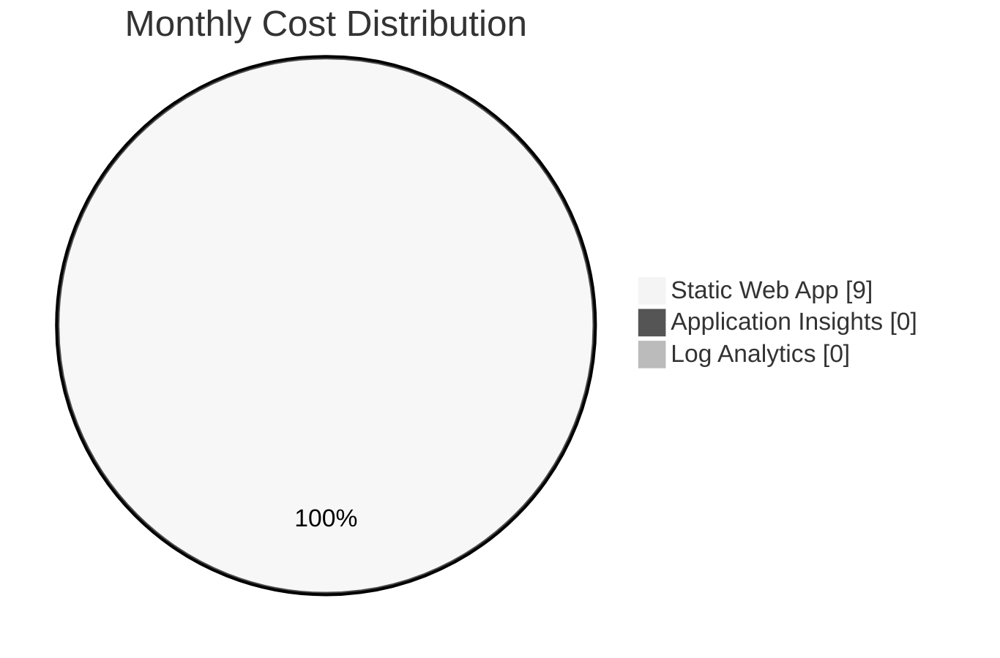

# As-Built Cost Estimate - infraops-static-demo

> **Version**: 1.0  
> **Date**: 2026-01-20  
> **Status**: As-Built  
> **Region**: West Europe

---

## Executive Summary

The **infraops-static-demo** workload is deployed with an estimated monthly cost of **~$9.00 USD**, well under the $15/month budget target. The architecture leverages Azure's free tiers for monitoring while using Standard tier for the Static Web App to meet the 99.9% SLA requirement.



---

## Cost Summary

| Resource                | Type                                     | SKU/Tier      | Monthly Cost | Annual Cost |
| ----------------------- | ---------------------------------------- | ------------- | ------------ | ----------- |
| Static Web App          | Microsoft.Web/staticSites                | Standard      | $9.00        | $108.00     |
| Application Insights    | Microsoft.Insights/components            | Pay-as-you-go | $0.00        | $0.00       |
| Log Analytics Workspace | Microsoft.OperationalInsights/workspaces | PerGB2018     | $0.00        | $0.00       |
| **Total**               |                                          |               | **$9.00**    | **$108.00** |

---

## Detailed Cost Breakdown

### Static Web App (Standard Tier)

| Component            | Unit          | Quantity | Unit Price | Monthly Cost |
| -------------------- | ------------- | -------- | ---------- | ------------ |
| Base Fee             | per app/month | 1        | $9.00      | $9.00        |
| Bandwidth (included) | GB/month      | 100      | $0.00      | $0.00        |
| Bandwidth (overage)  | per GB        | 0 (est.) | $0.20      | $0.00        |
| **Subtotal**         |               |          |            | **$9.00**    |

**Included Features:**

- 99.9% SLA
- 10 staging environments
- 500 MB storage per app
- 100 GB bandwidth per subscription
- Custom domains
- Managed SSL certificates
- GitHub/GitLab/Bitbucket integration

### Application Insights

| Component                | Unit     | Quantity      | Unit Price        | Monthly Cost |
| ------------------------ | -------- | ------------- | ----------------- | ------------ |
| Data Ingestion           | GB/month | <5 GB         | Free (first 5 GB) | $0.00        |
| Data Ingestion (overage) | per GB   | 0 (est.)      | $2.76             | $0.00        |
| Data Retention           | days     | 365 (default) | Included          | $0.00        |
| **Subtotal**             |          |               |                   | **$0.00**    |

**Assumptions:**

- Typical SPA traffic generates < 1 GB telemetry/month
- 5 GB/month free tier sufficient for demo workload
- 100% sampling rate configured

### Log Analytics Workspace

| Component                 | Unit         | Quantity | Unit Price        | Monthly Cost |
| ------------------------- | ------------ | -------- | ----------------- | ------------ |
| Data Ingestion            | GB/month     | <5 GB    | Free (first 5 GB) | $0.00        |
| Data Ingestion (overage)  | per GB       | 0 (est.) | $2.76             | $0.00        |
| Data Retention (30 days)  | days         | 30       | Included          | $0.00        |
| Data Retention (>30 days) | per GB/month | 0        | $0.10             | $0.00        |
| **Subtotal**              |              |          |                   | **$0.00**    |

**Assumptions:**

- 30-day retention (default, no extra cost)
- Data ingestion within 5 GB free tier
- No archive tier configured

---

## Cost Drivers

### Primary Cost Drivers

| Driver              | Impact | Current State       |
| ------------------- | ------ | ------------------- |
| Static Web App tier | High   | Standard ($9/month) |
| Bandwidth usage     | Low    | Included 100 GB     |
| Telemetry volume    | Low    | Within free tier    |

### Potential Cost Increases

| Scenario                     | Impact          | Mitigation                     |
| ---------------------------- | --------------- | ------------------------------ |
| Bandwidth > 100 GB/month     | +$0.20/GB       | Monitor usage, optimize assets |
| Telemetry > 5 GB/month       | +$2.76/GB       | Reduce sampling percentage     |
| Extended retention > 30 days | +$0.10/GB/month | Keep 30-day default            |

---

## Design vs As-Built Comparison

### IaC Coverage Analysis

| Resource                | In Design? | In IaC? | Deployed? |
| ----------------------- | ---------- | ------- | --------- |
| Static Web App          | ✅ Yes     | ✅ Yes  | ✅ Yes    |
| Application Insights    | ✅ Yes     | ✅ Yes  | ✅ Yes    |
| Log Analytics Workspace | ✅ Yes     | ✅ Yes  | ✅ Yes    |

### Cost Variance

| Metric               | Design Estimate | As-Built Actual | Variance       |
| -------------------- | --------------- | --------------- | -------------- |
| Static Web App       | $9.00           | $9.00           | $0.00 (0%)     |
| Application Insights | $0.00           | $0.00           | $0.00 (0%)     |
| Log Analytics        | $0.00           | $0.00           | $0.00 (0%)     |
| **Total**            | **~$9.00**      | **~$9.00**      | **$0.00 (0%)** |

**Variance Analysis:** As-built costs match design estimates exactly. No drift detected.

---

## Savings Opportunities

### Immediate Savings (No impact to functionality)

| Opportunity     | Savings | Trade-off                      |
| --------------- | ------- | ------------------------------ |
| None identified | -       | Architecture already optimized |

### Conditional Savings (Some impact)

| Opportunity                    | Savings   | Trade-off                |
| ------------------------------ | --------- | ------------------------ |
| Free tier Static Web App       | $9/month  | No SLA, limited features |
| Reduce App Insights sampling   | ~$0/month | Less telemetry detail    |
| Reduce Log retention to 7 days | ~$0/month | Less historical data     |

### Long-term Savings

| Opportunity          | Savings | When to Consider      |
| -------------------- | ------- | --------------------- |
| Reserved capacity    | N/A     | Not available for SWA |
| Azure Hybrid Benefit | N/A     | Not applicable        |

---

## Budget Analysis

| Metric                 | Value        |
| ---------------------- | ------------ |
| **Approved Budget**    | $15.00/month |
| **Estimated Cost**     | $9.00/month  |
| **Remaining Budget**   | $6.00/month  |
| **Budget Utilization** | 60%          |

### Budget Status: ✅ UNDER BUDGET

---

## Cost Optimization Recommendations

### Applied Optimizations

| Optimization               | Status     | Impact                |
| -------------------------- | ---------- | --------------------- |
| Use free monitoring tier   | ✅ Applied | -$2.76/GB saved       |
| Use Standard (not Premium) | ✅ Applied | Minimum viable tier   |
| Single region deployment   | ✅ Applied | No multi-region costs |
| 30-day log retention       | ✅ Applied | Minimum retention     |

### Future Optimizations

| Optimization              | Priority | Estimated Savings       |
| ------------------------- | -------- | ----------------------- |
| Enable cost alerts        | Medium   | Prevent overages        |
| Monitor bandwidth         | Low      | Prevent overage charges |
| Review telemetry sampling | Low      | Reduce potential costs  |

---

## Cost Monitoring Setup

### Recommended Alerts

```bash
# Create budget alert at 80% threshold
az consumption budget create \
  --budget-name "infraops-static-demo-budget" \
  --amount 15 \
  --category Cost \
  --resource-group rg-infraops-static-demo-prod \
  --time-grain Monthly \
  --start-date $(date +%Y-%m-01) \
  --end-date 2027-12-31
```

### Cost Tracking Query

```kusto
// Daily cost trend (requires Cost Management data export)
AzureDiagnostics
| where ResourceGroup == "rg-infraops-static-demo-prod"
| summarize DailyCost = sum(Cost) by bin(TimeGenerated, 1d)
| render timechart
```

---

## Pricing References

| Service              | Pricing Page                                                    |
| -------------------- | --------------------------------------------------------------- |
| Static Web Apps      | https://azure.microsoft.com/pricing/details/app-service/static/ |
| Application Insights | https://azure.microsoft.com/pricing/details/monitor/            |
| Log Analytics        | https://azure.microsoft.com/pricing/details/monitor/            |

**Pricing Region:** West Europe  
**Currency:** USD  
**Date Retrieved:** 2026-01-20

---

## Appendix: SKU Comparison

### Static Web App Tiers

| Feature              | Free     | Standard |
| -------------------- | -------- | -------- |
| Price                | $0/month | $9/month |
| SLA                  | None     | 99.9%    |
| Staging Environments | 3        | 10       |
| Custom Domains       | 2        | 5        |
| Storage              | 250 MB   | 500 MB   |
| Bandwidth            | 100 GB   | 100 GB   |
| Enterprise Auth      | ❌       | ✅       |

**Selection Rationale:** Standard tier selected to meet 99.9% SLA requirement.

---

_Cost estimate generated from as-built Bicep templates and Azure pricing data._
_Prices are estimates and may vary based on actual usage._
