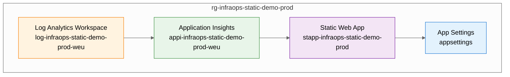

# Resource Inventory - infraops-static-demo

> **Version**: 1.0  
> **Date**: 2026-01-20  
> **Status**: As-Built  
> **Source**: Bicep templates + Azure Resource Graph

---

## Summary

| Category            | Count |
| ------------------- | ----- |
| **Compute**         | 1     |
| **Monitoring**      | 2     |
| **Configuration**   | 1     |
| **Total Resources** | 4     |

---

### Resource Group

| Property               | Value                                |
| ---------------------- | ------------------------------------ |
| **Name**               | rg-infraops-static-demo-prod         |
| **Subscription**       | noalz                                |
| **Subscription ID**    | 00858ffc-dded-4f0f-8bbf-e17fff0d47d9 |
| **Location**           | westeurope                           |
| **Provisioning State** | Succeeded                            |

---

## Resource Listing

### Resources

### Compute Resources

| Name                            | Type                      | SKU      | Location   | Tags                                                                                                  |
| ------------------------------- | ------------------------- | -------- | ---------- | ----------------------------------------------------------------------------------------------------- |
| stapp-infraops-static-demo-prod | Microsoft.Web/staticSites | Standard | westeurope | Environment=prod, ManagedBy=Bicep, Project=infraops-static-demo, Owner=infraops-team, CostCenter=demo |

#### Static Web App Details

| Property                       | Value                                                                                                                                                                 |
| ------------------------------ | --------------------------------------------------------------------------------------------------------------------------------------------------------------------- |
| **Resource ID**                | `/subscriptions/00858ffc-dded-4f0f-8bbf-e17fff0d47d9/resourceGroups/rg-infraops-static-demo-prod/providers/Microsoft.Web/staticSites/stapp-infraops-static-demo-prod` |
| **Default Hostname**           | blue-sky-09ca1ff03.4.azurestaticapps.net                                                                                                                              |
| **URL**                        | https://blue-sky-09ca1ff03.4.azurestaticapps.net                                                                                                                      |
| **SKU Tier**                   | Standard                                                                                                                                                              |
| **SLA**                        | 99.9%                                                                                                                                                                 |
| **Staging Environment Policy** | Enabled                                                                                                                                                               |
| **Config File Updates**        | Allowed                                                                                                                                                               |
| **Enterprise CDN**             | Disabled                                                                                                                                                              |

---

### Monitoring Resources

| Name                               | Type                                     | SKU       | Location   | Tags                                                                                                  |
| ---------------------------------- | ---------------------------------------- | --------- | ---------- | ----------------------------------------------------------------------------------------------------- |
| appi-infraops-static-demo-prod-weu | Microsoft.Insights/components            | -         | westeurope | Environment=prod, ManagedBy=Bicep, Project=infraops-static-demo, Owner=infraops-team, CostCenter=demo |
| log-infraops-static-demo-prod-weu  | Microsoft.OperationalInsights/workspaces | PerGB2018 | westeurope | Environment=prod, ManagedBy=Bicep, Project=infraops-static-demo, Owner=infraops-team, CostCenter=demo |

#### Application Insights Details

| Property                | Value                                                                                                                                                                        |
| ----------------------- | ---------------------------------------------------------------------------------------------------------------------------------------------------------------------------- |
| **Resource ID**         | `/subscriptions/00858ffc-dded-4f0f-8bbf-e17fff0d47d9/resourceGroups/rg-infraops-static-demo-prod/providers/Microsoft.Insights/components/appi-infraops-static-demo-prod-weu` |
| **Instrumentation Key** | 986e6dcd-159e-472a-b1ec-49e64100f183                                                                                                                                         |
| **Application Type**    | web                                                                                                                                                                          |
| **Kind**                | web                                                                                                                                                                          |
| **Retention**           | 365 days                                                                                                                                                                     |
| **Sampling Percentage** | 100%                                                                                                                                                                         |
| **Linked Workspace**    | log-infraops-static-demo-prod-weu                                                                                                                                            |

#### Log Analytics Workspace Details

| Property                              | Value                                                                                                                                                                                  |
| ------------------------------------- | -------------------------------------------------------------------------------------------------------------------------------------------------------------------------------------- |
| **Resource ID**                       | `/subscriptions/00858ffc-dded-4f0f-8bbf-e17fff0d47d9/resourceGroups/rg-infraops-static-demo-prod/providers/Microsoft.OperationalInsights/workspaces/log-infraops-static-demo-prod-weu` |
| **SKU**                               | PerGB2018                                                                                                                                                                              |
| **Retention**                         | 30 days                                                                                                                                                                                |
| **Daily Cap**                         | Unlimited                                                                                                                                                                              |
| **Public Network Access (Ingestion)** | Enabled                                                                                                                                                                                |
| **Public Network Access (Query)**     | Enabled                                                                                                                                                                                |

---

### Configuration Resources

| Name        | Type                             | Parent Resource                 |
| ----------- | -------------------------------- | ------------------------------- |
| appsettings | Microsoft.Web/staticSites/config | stapp-infraops-static-demo-prod |

#### App Settings Details

| Setting                               | Purpose                             |
| ------------------------------------- | ----------------------------------- |
| APPLICATIONINSIGHTS_CONNECTION_STRING | Application Insights SDK connection |
| APPINSIGHTS_INSTRUMENTATIONKEY        | Legacy instrumentation key          |

---

### Dependencies



---

### Resource IDs

| Resource           | Full Resource ID                                                                                                                                                                       |
| ------------------ | -------------------------------------------------------------------------------------------------------------------------------------------------------------------------------------- |
| **Resource Group** | `/subscriptions/00858ffc-dded-4f0f-8bbf-e17fff0d47d9/resourceGroups/rg-infraops-static-demo-prod`                                                                                      |
| **Log Analytics**  | `/subscriptions/00858ffc-dded-4f0f-8bbf-e17fff0d47d9/resourceGroups/rg-infraops-static-demo-prod/providers/Microsoft.OperationalInsights/workspaces/log-infraops-static-demo-prod-weu` |
| **App Insights**   | `/subscriptions/00858ffc-dded-4f0f-8bbf-e17fff0d47d9/resourceGroups/rg-infraops-static-demo-prod/providers/Microsoft.Insights/components/appi-infraops-static-demo-prod-weu`           |
| **Static Web App** | `/subscriptions/00858ffc-dded-4f0f-8bbf-e17fff0d47d9/resourceGroups/rg-infraops-static-demo-prod/providers/Microsoft.Web/staticSites/stapp-infraops-static-demo-prod`                  |

---

### Azure Verified Modules Used

| Module                                 | Version | Resource Type           |
| -------------------------------------- | ------- | ----------------------- |
| avm/res/operational-insights/workspace | 0.15.0  | Log Analytics Workspace |
| avm/res/insights/component             | 0.7.1   | Application Insights    |
| avm/res/web/static-site                | 0.9.3   | Static Web App          |

---

### IaC Files

| File                 | Path                                                            | Purpose              |
| -------------------- | --------------------------------------------------------------- | -------------------- |
| main.bicep           | `infra/bicep/infraops-static-demo/main.bicep`                   | Orchestration        |
| main.bicepparam      | `infra/bicep/infraops-static-demo/main.bicepparam`              | Parameters           |
| log-analytics.bicep  | `infra/bicep/infraops-static-demo/modules/log-analytics.bicep`  | Log Analytics module |
| app-insights.bicep   | `infra/bicep/infraops-static-demo/modules/app-insights.bicep`   | App Insights module  |
| static-web-app.bicep | `infra/bicep/infraops-static-demo/modules/static-web-app.bicep` | SWA module           |
| deploy.ps1           | `infra/bicep/infraops-static-demo/deploy.ps1`                   | Deployment script    |

---

## Tags Applied

All resources are tagged with:

| Tag         | Value                |
| ----------- | -------------------- |
| Environment | prod                 |
| ManagedBy   | Bicep                |
| Project     | infraops-static-demo |
| Owner       | infraops-team        |
| CostCenter  | demo                 |

---

### Query Commands

### List Resources in Resource Group

```bash
az resource list --resource-group rg-infraops-static-demo-prod \
  --query "[].{Name:name, Type:type, Location:location}" \
  --output table
```

### Query via Azure Resource Graph

```kusto
resources
| where resourceGroup =~ 'rg-infraops-static-demo-prod'
| project name, type, location, tags
```

### Get Static Web App Details

```bash
az staticwebapp show \
  --name stapp-infraops-static-demo-prod \
  --resource-group rg-infraops-static-demo-prod
```

---

_Inventory generated from Bicep templates and Azure Resource Graph._
_Last updated: 2026-01-20_
