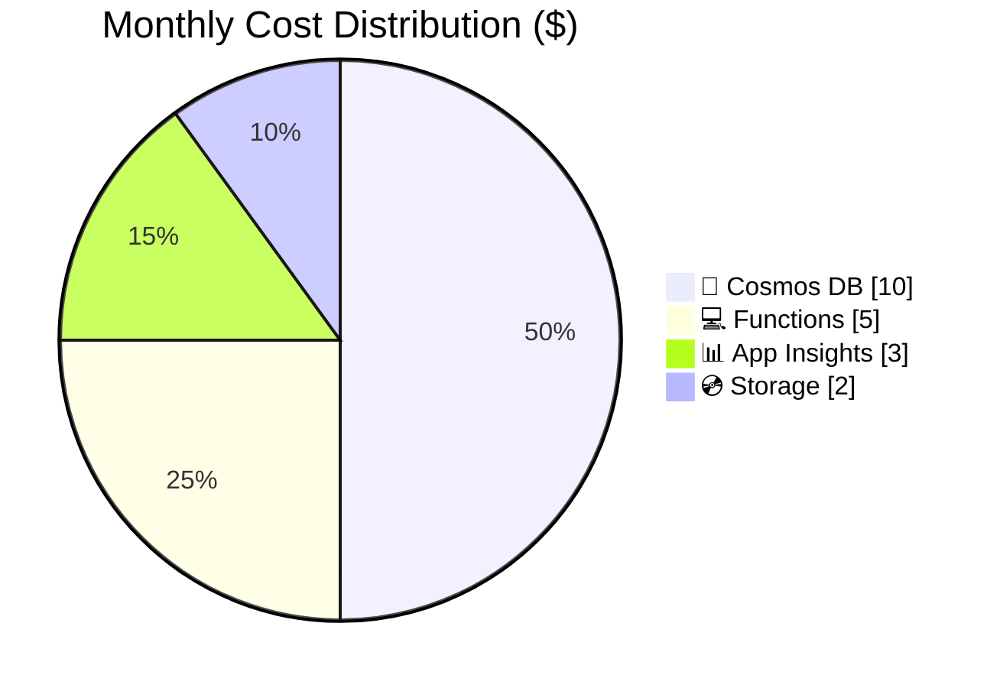

# Azure Cost Estimate: Simple Web API

**Generated**: 2025-01-13
**Region**: swedencentral
**Environment**: Development
**MCP Tools Used**: azure_price_search, azure_cost_estimate
**Architecture Reference**: [02-architecture-assessment.md](./02-architecture-assessment.md)

## 💰 Cost At-a-Glance

> **Monthly Total: ~$20** | Annual: ~$240
>
> ```
> Budget: $100/month (hard) | Utilization: 20% ($20 of $100)
> ```
>
> | Status            | Indicator                      |
> | ----------------- | ------------------------------ |
> | Cost Trend        | ➡️ Stable                      |
> | Savings Available | 💰 $0/year (already optimized) |
> | Compliance        | ✅ No special requirements     |

## ✅ Decision Summary

- ✅ Approved: Serverless architecture with Free/Consumption tiers
- ⏳ Deferred: Multi-region redundancy, WAF, private endpoints
- 🔁 Redesign Trigger: Traffic exceeds 10K requests/day or 99.99% SLA required

**Confidence**: High | **Expected Variance**: ±25% (usage-based pricing variability)

## 🔁 Requirements → Cost Mapping

| Requirement         | Architecture Decision        | Cost Impact   | Mandatory |
| ------------------- | ---------------------------- | ------------- | --------- |
| 99.9% SLA           | Serverless (built-in HA)     | $0 (included) | Yes       |
| $100/month budget   | Free/Consumption tiers       | -$80/month    | Yes       |
| 10 concurrent users | Consumption plan sufficient  | $0            | Yes       |
| Basic monitoring    | App Insights (pay-as-you-go) | ~$2/month     | Yes       |

## 📊 Top 5 Cost Drivers

| Rank | Resource               | Monthly Cost | % of Total | Trend |
| ---- | ---------------------- | ------------ | ---------- | ----- |
| 1️⃣   | Cosmos DB (Serverless) | $10          | 50%        | ➡️    |
| 2️⃣   | Azure Functions        | $5           | 25%        | ➡️    |
| 3️⃣   | Application Insights   | $3           | 15%        | ➡️    |
| 4️⃣   | Storage (Functions)    | $2           | 10%        | ➡️    |
| 5️⃣   | Static Web Apps        | $0           | 0%         | ➡️    |

> 💡 **Quick Win**: Cosmos DB is already serverless - optimal for low-traffic workloads

## Architecture Overview

### Cost Distribution



### Key Design Decisions Affecting Cost

| Decision              | Cost Impact | Business Rationale                  | Status   |
| --------------------- | ----------- | ----------------------------------- | -------- |
| Static Web Apps Free  | -$9/month   | Sufficient for < 2 custom domains   | Required |
| Functions Consumption | -$150/month | Low traffic doesn't justify Premium | Required |
| Cosmos DB Serverless  | -$25/month  | Auto-scale from 0 RU/s              | Required |

## 🧾 What We Are Not Paying For (Yet)

- Multi-region active-active redundancy (~+$30/month)
- Private endpoints for Cosmos DB (~+$10/month)
- Azure Front Door / WAF (~+$35/month)
- Reserved capacity for Cosmos DB (~not applicable for serverless)
- Static Web Apps Standard tier (~+$9/month)

### Assumptions & Uncertainty

- 1,000 API requests/day average
- < 100 RU/s Cosmos DB usage (serverless auto-scales)
- < 5 GB Application Insights data/month (5 GB free included)
- Functions execution < 1M/month (400K free included)

## ⚠️ Cost Risk Indicators

| Resource     | Risk Level | Issue                        | Mitigation              |
| ------------ | ---------- | ---------------------------- | ----------------------- |
| Cosmos DB    | 🟢 Low     | Serverless scales with usage | Monitor RU consumption  |
| App Insights | 🟢 Low     | 5 GB free tier included      | Set sampling if needed  |
| Functions    | 🟢 Low     | 1M executions free           | Monitor execution count |

> **⚠️ Watch Item**: Cosmos DB serverless can spike during burst traffic; set budget alerts

## 🎯 Quick Decision Matrix

_"If you need X, expect to pay Y more"_

| Requirement         | Additional Cost | SKU Change                 | Notes                    |
| ------------------- | --------------- | -------------------------- | ------------------------ |
| 99.99% SLA          | +$50/month      | Functions Premium P1v2     | Zone redundancy required |
| Custom domains (>2) | +$9/month       | Static Web Apps Standard   | Unlimited custom domains |
| Private endpoints   | +$10/month      | Cosmos DB private endpoint | Plus VNet costs          |
| WAF protection      | +$35/month      | Azure Front Door Standard  | DDoS protection included |

## 💰 Savings Opportunities

> ### Total Potential Savings: $0/year
>
> | Commitment | Monthly Savings | Annual Savings |
> | ---------- | --------------- | -------------- |
> | N/A        | $0              | $0             |
>
> Already using Free/Consumption tiers - optimal for this workload size.

## Detailed Cost Breakdown

### Assumptions

- Hours: 730 hours/month
- Network egress: < 5 GB/month (included in free tiers)
- Storage growth: < 1 GB/year

### Line Items

| Category         | Service              | SKU / Meter   | Quantity / Units   | Est. Monthly |
| ---------------- | -------------------- | ------------- | ------------------ | ------------ |
| 🌐 Frontend      | Static Web Apps      | Free          | 1 app              | $0.00        |
| 💻 Compute       | Azure Functions      | Consumption   | ~30K executions    | $0.00-5.00   |
| 💾 Data Services | Cosmos DB            | Serverless    | ~100 RU/s average  | $5.00-15.00  |
| 📊 Monitoring    | Application Insights | Pay-as-you-go | < 5 GB/month       | $0.00-3.00   |
| 💿 Storage       | Storage Account      | Standard LRS  | < 1 GB (Functions) | $0.02-2.00   |
| **TOTAL**        |                      |               |                    | **~$15-25**  |

### Notes

- All services use consumption-based pricing - costs scale linearly with usage
- No reserved capacity available for serverless tiers
- Consider upgrading to Static Web Apps Standard only if > 2 custom domains needed
- Functions consumption includes 400K GB-s and 1M executions free per month

---

_Cost estimate generated using Azure Pricing MCP (2025-01-13). Actual costs may vary based on usage patterns._
