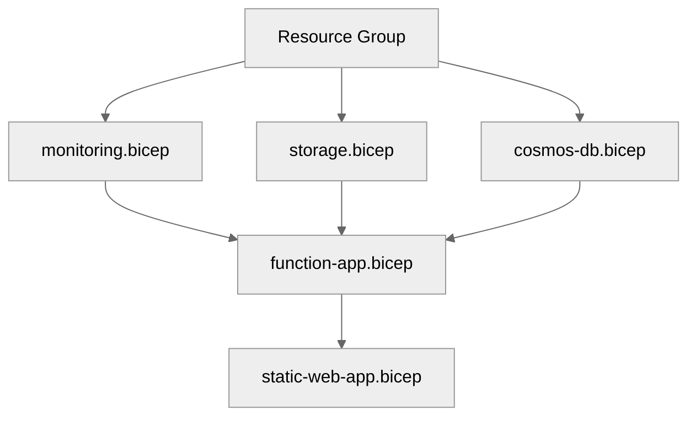

# Step 4: Implementation Plan - Simple Web API

> Generated by bicep-plan agent | 2025-01-13

## Overview

This implementation plan defines the Bicep infrastructure-as-code for a serverless web API
using Azure Static Web Apps, Azure Functions, Cosmos DB, and Application Insights.
The architecture follows cost-optimized patterns using Free and Consumption tiers.

---

## Resource Inventory

| Resource             | Type                                               | SKU          | Dependencies          |
| -------------------- | -------------------------------------------------- | ------------ | --------------------- |
| Resource Group       | Microsoft.Resources/resourceGroups                 | N/A          | None                  |
| Static Web Apps      | Microsoft.Web/staticSites                          | Free         | None                  |
| Function App         | Microsoft.Web/sites                                | Consumption  | Storage, App Insights |
| App Service Plan     | Microsoft.Web/serverfarms                          | Y1           | None                  |
| Storage Account      | Microsoft.Storage/storageAccounts                  | Standard_LRS | None                  |
| Cosmos DB Account    | Microsoft.DocumentDB/databaseAccounts              | Serverless   | None                  |
| Cosmos DB Database   | Microsoft.DocumentDB/databaseAccounts/sqlDatabases | N/A          | Cosmos Account        |
| Application Insights | Microsoft.Insights/components                      | PayAsYouGo   | Log Analytics         |
| Log Analytics        | Microsoft.OperationalInsights/workspaces           | Free         | None                  |

---

## Module Structure

```
infra/bicep/simple-web-api/
├── main.bicep              # Orchestration module
├── main.bicepparam         # Parameter file
├── modules/
│   ├── static-web-app.bicep    # Static Web Apps
│   ├── function-app.bicep      # Function App + Plan
│   ├── cosmos-db.bicep         # Cosmos DB account + database
│   ├── storage.bicep           # Storage account
│   └── monitoring.bicep        # App Insights + Log Analytics
└── deploy.ps1              # Deployment script
```

---

## Implementation Tasks

### Task 1: main.bicep (Orchestration)

**Purpose**: Main entry point that orchestrates all modules

**Parameters**:

- `projectName` - Project name for resource naming (default: 'simple-web-api')
- `environment` - Environment name: dev, staging, prod (default: 'dev')
- `location` - Azure region (default: 'swedencentral')
- `owner` - Owner tag value

**Variables**:

- `uniqueSuffix = uniqueString(resourceGroup().id)` - Unique suffix for global names
- `tags` - Standard tags object

**Modules Called**:

1. monitoring.bicep (deployed first for App Insights)
2. storage.bicep
3. cosmos-db.bicep
4. function-app.bicep
5. static-web-app.bicep

### Task 2: modules/monitoring.bicep

**Resources**:

- Log Analytics Workspace (Free tier, 30-day retention)
- Application Insights (connected to Log Analytics)

**Key Configuration**:

```bicep
resource logAnalytics 'Microsoft.OperationalInsights/workspaces@2023-09-01' = {
  name: 'log-${projectName}-${environment}-${uniqueSuffix}'
  location: location
  properties: {
    sku: { name: 'PerGB2018' }
    retentionInDays: 30
  }
  tags: tags
}
```

**Outputs**:

- `logAnalyticsWorkspaceId` - Workspace resource ID
- `appInsightsConnectionString` - Connection string for apps
- `appInsightsInstrumentationKey` - Instrumentation key

### Task 3: modules/storage.bicep

**Resources**:

- Storage Account (Standard_LRS, required for Functions)

**Key Configuration**:

```bicep
resource storage 'Microsoft.Storage/storageAccounts@2023-05-01' = {
  name: 'st${take(replace(projectName, '-', ''), 14)}${take(uniqueSuffix, 6)}'
  location: location
  kind: 'StorageV2'
  sku: { name: 'Standard_LRS' }
  properties: {
    supportsHttpsTrafficOnly: true
    minimumTlsVersion: 'TLS1_2'
    allowBlobPublicAccess: false
  }
  tags: tags
}
```

**Outputs**:

- `storageAccountId` - Storage account resource ID
- `storageAccountName` - Storage account name
- `storagePrimaryEndpoint` - Primary blob endpoint

### Task 4: modules/cosmos-db.bicep

**Resources**:

- Cosmos DB Account (Serverless capability)
- SQL Database
- SQL Container (items)

**Key Configuration**:

```bicep
resource cosmosAccount 'Microsoft.DocumentDB/databaseAccounts@2024-05-15' = {
  name: 'cosmos-${projectName}-${environment}-${take(uniqueSuffix, 8)}'
  location: location
  kind: 'GlobalDocumentDB'
  properties: {
    databaseAccountOfferType: 'Standard'
    capabilities: [{ name: 'EnableServerless' }]
    locations: [{ locationName: location, failoverPriority: 0 }]
    consistencyPolicy: { defaultConsistencyLevel: 'Session' }
    publicNetworkAccess: 'Enabled'
    minimalTlsVersion: 'Tls12'
  }
  tags: tags
}
```

**Outputs**:

- `cosmosAccountId` - Cosmos account resource ID
- `cosmosAccountName` - Cosmos account name
- `cosmosEndpoint` - Cosmos document endpoint

### Task 5: modules/function-app.bicep

**Resources**:

- App Service Plan (Consumption Y1)
- Function App
- System-assigned managed identity

**Key Configuration**:

```bicep
resource functionApp 'Microsoft.Web/sites@2023-12-01' = {
  name: 'func-${projectName}-${environment}-${take(uniqueSuffix, 8)}'
  location: location
  kind: 'functionapp'
  identity: { type: 'SystemAssigned' }
  properties: {
    serverFarmId: appServicePlan.id
    httpsOnly: true
    siteConfig: {
      ftpsState: 'Disabled'
      minTlsVersion: '1.2'
      appSettings: [
        { name: 'AzureWebJobsStorage', value: storageConnectionString }
        { name: 'FUNCTIONS_EXTENSION_VERSION', value: '~4' }
        { name: 'FUNCTIONS_WORKER_RUNTIME', value: 'node' }
        { name: 'APPLICATIONINSIGHTS_CONNECTION_STRING', value: appInsightsConnectionString }
      ]
    }
  }
  tags: tags
}
```

**Outputs**:

- `functionAppId` - Function App resource ID
- `functionAppName` - Function App name
- `functionAppHostname` - Function App default hostname
- `functionAppPrincipalId` - Managed identity principal ID

### Task 6: modules/static-web-app.bicep

**Resources**:

- Static Web App (Free tier)

**Key Configuration**:

```bicep
resource staticWebApp 'Microsoft.Web/staticSites@2023-12-01' = {
  name: 'swa-${projectName}-${environment}-${take(uniqueSuffix, 8)}'
  location: location
  sku: { name: 'Free', tier: 'Free' }
  properties: {
    stagingEnvironmentPolicy: 'Enabled'
    allowConfigFileUpdates: true
  }
  tags: tags
}
```

**Outputs**:

- `staticWebAppId` - Static Web App resource ID
- `staticWebAppName` - Static Web App name
- `staticWebAppDefaultHostname` - Default hostname

### Task 7: deploy.ps1 (Deployment Script)

**Features**:

- Parameter validation
- Bicep lint/build verification
- What-If preview (with `$WhatIfPreference` support)
- Deployment execution
- Output display

**Script Structure**:

```powershell
[CmdletBinding(SupportsShouldProcess)]
param(
    [Parameter(Mandatory = $false)]
    [string]$Environment = 'dev',

    [Parameter(Mandatory = $false)]
    [string]$Location = 'swedencentral'
)
```

---

## Dependency Graph



---

## Naming Conventions

| Resource        | Pattern                                     | Example                            |
| --------------- | ------------------------------------------- | ---------------------------------- |
| Resource Group  | rg-{project}-{env}                          | rg-simple-web-api-dev              |
| Static Web App  | swa-{project}-{env}-{suffix}                | swa-simple-web-api-dev-abc123      |
| Function App    | func-{project}-{env}-{suffix}               | func-simple-web-api-dev-abc123     |
| Cosmos DB       | cosmos-{project}-{env}-{suffix}             | cosmos-simple-web-api-dev-abc12345 |
| Storage Account | st{project}{suffix} (no hyphens, ≤24 chars) | stsimplewebapiabc123               |
| App Insights    | appi-{project}-{env}-{suffix}               | appi-simple-web-api-dev-abc123     |
| Log Analytics   | log-{project}-{env}-{suffix}                | log-simple-web-api-dev-abc123      |

---

## Security Configuration

| Resource        | Security Setting         | Value          |
| --------------- | ------------------------ | -------------- |
| Storage Account | supportsHttpsTrafficOnly | true           |
| Storage Account | minimumTlsVersion        | TLS1_2         |
| Storage Account | allowBlobPublicAccess    | false          |
| Function App    | httpsOnly                | true           |
| Function App    | ftpsState                | Disabled       |
| Function App    | minTlsVersion            | 1.2            |
| Function App    | identity                 | SystemAssigned |
| Cosmos DB       | minimalTlsVersion        | Tls12          |
| Cosmos DB       | publicNetworkAccess      | Enabled        |

---

## Estimated Implementation Time

| Task                 | Estimated Duration |
| -------------------- | ------------------ |
| Bicep modules        | 60 minutes         |
| Testing (lint/build) | 15 minutes         |
| What-If validation   | 10 minutes         |
| Deployment           | 10 minutes         |
| **Total**            | **~95 minutes**    |

---

## Approval Gate

> **📋 Implementation Plan Ready**
>
> - 9 Azure resources planned
> - 5 Bicep modules to create
> - Governance constraints addressed
> - CAF naming conventions applied
> - Security hardening included
>
> Reply **"approve"** to proceed to bicep-implement, or provide feedback.

---

_Plan generated by bicep-plan agent following Azure Well-Architected Framework guidelines._
